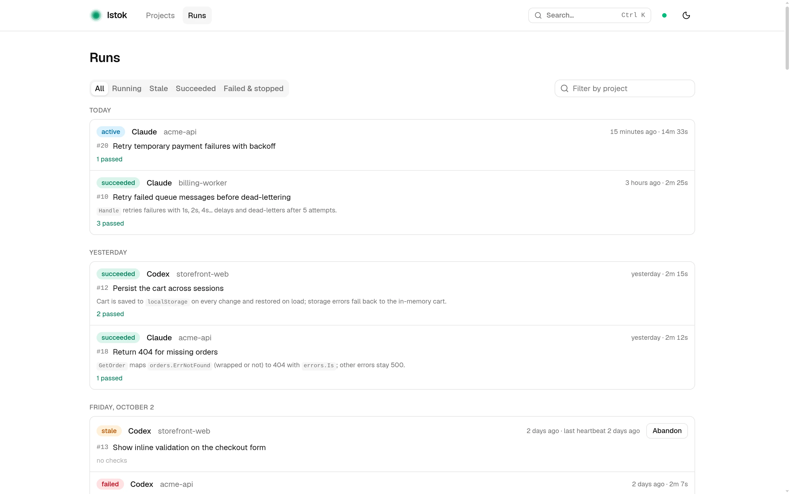

<p align="center">
  
</p>

<h1 align="center">Istok</h1>

<p align="center">
  One workspace for every coding agent.
</p>

<p align="center">
  <a href="https://istok.sh">Website</a>
  ·
  <a href="https://istok.sh/docs/en/getting-started/quick-start">Quick start</a>
  ·
  <a href="https://istok.sh/docs/ru/getting-started/quick-start">Документация на русском</a>
  ·
  <a href="https://github.com/vtimame/istok.sh/releases">Releases</a>
</p>

<p align="center">
  <a href="https://github.com/vtimame/istok.sh/releases">
    
  </a>
  <a href="./LICENSE">
    
  </a>
  <a href="https://istok.sh">
    
  </a>
</p>

Istok keeps your coding agent's work with your project instead of inside one conversation: the tasks, every attempt, the checks that prove the result, and the rules your project lives by. A new session — or a different agent — picks up where the last one stopped, and you can see all of it in your browser.

<picture>
  <source media="(prefers-color-scheme: dark)" srcset=".github/assets/ui-runs-dark.webp">
  
</picture>

## Why

If you work with Claude Code, Codex or Cursor, three things keep getting in the way:

- **Sessions end.** Close the chat or hit the context limit, and the plan, the decisions and the half-finished work go with it.
- **Work is invisible.** With several agents in several repositories, it is hard to tell who did what and what quietly stalled.
- **"Done" is a claim.** The agent says the tests pass; nothing shows that it ran them.

Istok is a local CLI, MCP server and web UI. Your agent records its work through MCP while it goes; you keep talking to it as before. Everything stays on your machine in one SQLite file: no account, no cloud, and nothing written into your repository.

## Quick start

**1. Install** (Linux and macOS, no root needed):

```sh
curl -fsSL https://get.istok.sh | sh
```

**2. Connect your agent** once, for your user. For Claude Code:

```sh
claude mcp add --transport stdio --scope user istok -- \
  istok mcp --actor-id claude --actor-name "Claude Code"
```

For Codex:

```sh
codex mcp add istok -- \
  istok mcp --actor-id codex --actor-name "Codex"
```

Cursor and other MCP clients are covered in the [quick start](https://istok.sh/docs/en/getting-started/quick-start), together with a short block of instructions that tells the agent when to use Istok.

**3. Ask the agent to register your project.** Start it in the repository and say:

> Register this project in Istok.

Then give it real work as usual. It creates a task, claims it, runs the checks through Istok and completes the task with that evidence.

**4. See what happened:**

```sh
istok ui
```

The web UI opens on `http://127.0.0.1:7700` with every project, task, run and check, and updates live while agents work.

## Learn more

- [What is Istok](https://istok.sh/docs/en/getting-started/introduction) — the problem and what you get.
- [Working with your agent](https://istok.sh/docs/en/guides/working-with-agents) — what to say to continue work, remember a rule or hand over to another agent.
- [Web UI](https://istok.sh/docs/en/guides/web-ui) and [running it as a service](https://istok.sh/docs/en/guides/updates-and-service).
- [How Istok works](https://istok.sh/docs/en/how-istok-works/projects) — projects, tasks and runs, validation, context and knowledge.
- [CLI](https://istok.sh/docs/en/reference/cli-overview) and [MCP tools](https://istok.sh/docs/en/reference/mcp) reference.
- [Troubleshooting](https://istok.sh/docs/en/help/troubleshooting) and [FAQ](https://istok.sh/docs/en/help/faq).

The documentation is also available [in Russian](https://istok.sh/docs/ru/getting-started/introduction), and as [`llms.txt`](https://istok.sh/llms.txt) for agents.

## Platforms

Releases are built for Linux (x86-64, ARM64) and macOS (Intel, Apple Silicon). Windows is not supported yet.

Releases are signed. `istok update` checks for a newer stable release, verifies it, backs up the database and migrates it; `istok update --check` only reports.

## Build from source

Istok is written in Go with an embedded React web UI. Building needs Go with cgo (for SQLite) and pnpm:

```sh
make build      # writes bin/istok
make install    # installs into ~/.local/bin
go test ./...
```

A source build cannot update itself; install an official release for `istok update`.

## License

[Apache 2.0](./LICENSE). Changes are listed in the [changelog](./CHANGELOG.md).
